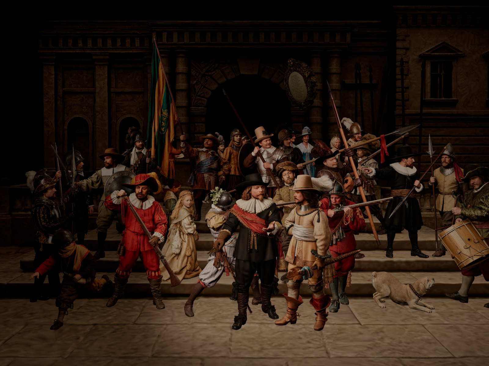
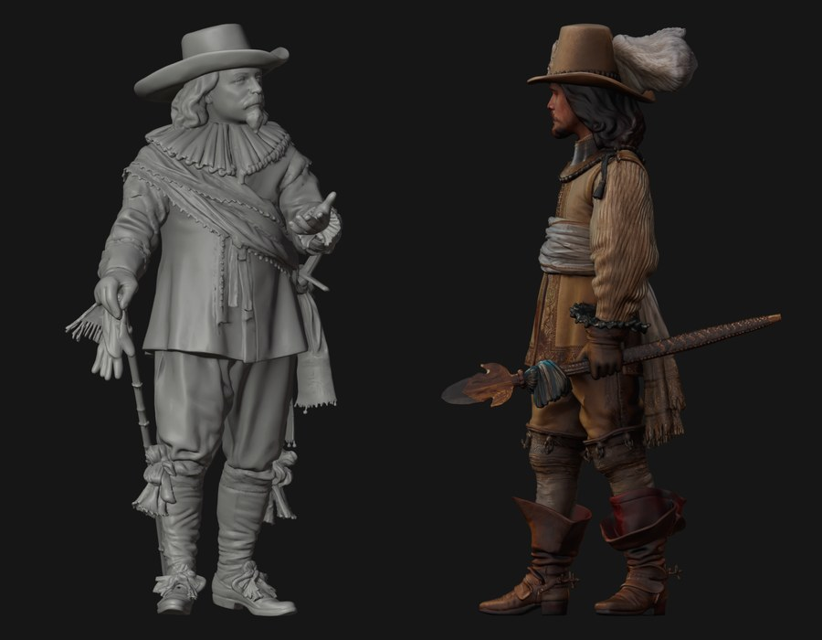

# The Night Watch in 3D

A browser reproduction of Rembrandt's *The Night Watch* (1642), and notes on how a 6 GB Blender scene became a 60 MB web page.

**[Open the scene →](https://pavljenko.ru/blogs/tools/night_watch_3d?lang=en)** · [Lieutenant demo](https://pavljenko.github.io/night-watch-3d/demo/) · [Captain (STL)](models/captain_frans_banninck_cocq_100k.stl) · [Русская версия](README.ru.md)



## What this is

The scene contains 24 people and the dog from the painting, the gate with the arch, the staircase and the shield above the arch. The camera settles on the painting's viewpoint (a button brings you back to it), and every figure has its own light on the face, as in Rembrandt's chiaroscuro. Tap a figure and a card opens with the person's name, years, biography and sources. The identifications follow Dudok van Heel (*Rijksmuseum Bulletin*, 2009); the cards are in Russian and English.

I also added a few things that are not in the painting. My friends are in the crowd, with their permission. My dogs Totoshka and Chip are there too, along with the "Amsterdam cavalry": three spaniels, one of them ridden by a cat, a nod to the Brothers Grimm's *Town Musicians of Bremen* and Chekhov's *Kashtanka*. I am also in the scene, reading a scroll. On the shield, the names of the guardsmen are replaced with a quote from Gogol's *Dead Souls* (1842), published two hundred years after the painting.

This repository is a case study, not a library. It collects the viewer code, the Blender and Python scripts as they were used, the measurements, and two figures you can download.

## What is not new

Full-scene 3D versions of *The Night Watch* have existed for years:
- the bronze group by Mikhail Dronov and Alexander Taratynov on Rembrandtplein (22 figures, 2006);
- Estella Tse's Tilt Brush VR painting (CES 2019);
- a LEGO version with Rembrandt-style lighting (2020).

In August 2026 another author posted AI-generated 3D figures from the painting for printing miniatures. The Rijksmuseum's [Beleef de Nachtwacht](https://www.q42.nl/en/work/night-watch-experience) already explains who is who, in 2D. Walking into a painting in the browser is also common, for example *Las Meninas* in Mozilla Hubs and many Van Gogh bedrooms on Sketchfab.

I did not find a browser 3D scene of *The Night Watch* that combines all of these:
- the figures modelled from the painting;
- the painting's camera;
- per-figure lighting;
- clickable cards with sources.

That is the only claim this project makes. The techniques below are standard; the section [What is standard here](#what-is-standard-here) says so for each one.

## Models in this repository



**Captain Frans Banninck Cocq:** [`models/captain_frans_banninck_cocq_100k.stl`](models/captain_frans_banninck_cocq_100k.stl), geometry only.
- GitHub shows STL files in an interactive viewer: open the file and rotate it.
- 100,000 triangles, 5 MB, scaled to 100 mm tall (1:18.6), feet on the build plate.

**Lieutenant Willem van Ruytenburch:** [`models/lieutenant_willem_van_ruytenburch.glb`](models/lieutenant_willem_van_ruytenburch.glb), with texture.
- 200,000 triangles, Draco geometry, 2560 px JPEG texture, 1.7 MB.
- GitHub's built-in viewer only shows untextured STL, so the textured model has its own page: **[demo](https://pavljenko.github.io/night-watch-3d/demo/)** (model-viewer).

**3D printing.** The level of detail is enough to print the figures as miniatures.
- The AI-generated meshes came out almost closed. The captain had 12 open edges and the lieutenant 6, all shorter than 1.3 mm on a 1.86 m figure.
- In the STL these edges are collapsed, so the mesh is watertight: 0 open and 0 non-manifold edges.
- At small scales, thin parts (feathers, the partisan, cuffs) may still need thickening in the slicer.

The other figures stay on the website. The full-resolution source scene is not published.

## How it was made

| Stage | Tools |
|---|---|
| Reference views of each figure before 3D generation | Nano Banana 2, GPT image generation (paid accounts) |
| Image-to-3D for figures, background, props | Tripo AI (paid account) |
| Manual corrections | Rhino 8, Blender 4.3 |
| Scene assembly, lighting, camera matched to the painting | Blender 4.3 (Cycles, light linking) |
| Compression scripts, web viewer, research for the cards | written with Claude (Anthropic) |
| Viewer | three.js r160 (WebGLRenderer), esbuild |
| Hosting | the file storage and CDN of my website (InSales) |

**AI disclosure.** The meshes and textures were generated by AI tools from reference images and then corrected by hand. Purely AI-generated parts may not be protected by copyright in some jurisdictions. The licence below applies to the human-made parts: corrections, scene composition, lighting, code and texts.

## From 6 GB to 60 MB

| | Source scene (Blender) | Web scene |
|---|---|---|
| Objects | 46 | 46 |
| Triangles | 76.96 M in total (Tripo output, e.g. 1.13 M per pike) | 8.54 M in total: 200k per figure, 150k per pike, more where lettering is protected |
| Textures | 8K, 378 MB | 38 × 2560 px WebP (desktop), 1280 px set for phones |
| Size | 6 GB `.blend` + 378 MB textures | 63 MB download on desktop (60 MiB), 37 MB on phones |
| Video memory for textures | — | ≈1.3 GB desktop set, ≈0.3 GB phone set |
| Lights | Cycles rig: 44 lights, most of them linked to single figures; wall spots; arch blocker | 38 lights compiled into the materials they belong to, 6 global lights + a hemisphere light |
| Frame time, 1600×1000, Apple M4 Pro | — | 6 ms (139 ms before the lighting change) |

The steps, in order (scripts and settings in [`pipeline/`](pipeline/README.md)):

1. **Light rig in Blender:** a face spotlight per figure with light linking; wall lights; an invisible blocker in the arch.
2. **Lettering:** the quote baked into the shield; the same quote inked onto the inner side of my scroll.
3. **Decimate (Collapse), one object at a time** from the 6 GB file: 200k triangles per figure, 150k per pike. The two lettered objects are re-decimated with the text area protected.
4. **Textures:** 2560 px, duplicates removed (54 → 38), WebP q87 for colour and q95 for data.
5. **One GLB:** Draco level 7, quantization 14/10/14 bits (position/normal/texcoord), 63 MB. Lights, camera and blocker go to JSON.
6. **For the site:** the GLB is split into geometry parts and separate textures (a 2560 px set for desktop, 1280 px for phones). The viewer is bundled with esbuild.

## Technical notes

### Geometry: Decimate on the original UVs
I tested one figure (Barent Harmansen Bolhamer) at 200k, 100k and 60k triangles before compressing the scene:
- **200k:** visually close to the original.
- **100k:** loses thin eyelids and strands of hair.
- **60k:** looks faceted.

On that figure the geometry weighed 0.66 MB at 200k with Draco, while the 8K texture weighed 12.4 MB. On the web, textures set the weight, not polygons.

UV seams mostly survived Blender's Decimate (Collapse) on the original, heavily fragmented UVs. On the test figure (252 UV islands) only 2–3 triangles crossed a seam, so the web scene needed no rebaking. I did not investigate why; treat it as an observation on these meshes, not a rule.

### Lettering survives only if you protect it
Text painted into a texture (the Gogol quote on the shield and on my scroll) was distorted after decimation. Large triangles skew the image mapped onto them. The text areas were re-decimated with a vertex group so that the lettering stays untouched:
- the scroll: 305k triangles, 105k of them kept as they were;
- the shield: 281k triangles, 81k kept.

Watch out: in Blender's Decimate modifier with `invert_vertex_group=True`, weight 1 means "simplify" and 0 means "keep".

### Textures: WebP, two sets
- **Format test** on one 2560 px texture:
  - JPEG q85: 1.06 MB;
  - WebP q85: 0.74 MB at the same PSNR (38 dB);
  - KTX2 ETC1S: 1.26 MB and visibly worse (PSNR 33.8).
- **Not a benchmark.** It is one texture, and UASTC was not tested.
- **Trade-off.** WebP is decoded to RGBA in video memory, four to eight times more than KTX2 would take. That is why phones and tablets get a separate 1280 px set.

### Lighting: per-figure lights in WebGLRenderer
In Blender each figure has its own face spotlight, linked only to that figure (Cycles light linking). The first web version recreated all 44 lights as ordinary three.js lights. On an Apple M4 Pro at 1600×1000:

| Lights in the scene | Frame time |
|---|---|
| all 44 | 139 ms (7 fps) |
| without the 34 face spotlights | 8.5 ms |
| no lights at all | 3.4 ms |

So the cost was the per-pixel loop over all lights in every material, not the number of triangles (over 8 million).

**The fix:**
- Each face spotlight is injected only into its own figure's material through `onBeforeCompile`.
- The arch occluder for the wall lights is an analytic segment test instead of shadow maps.
- 6 global lights and a hemisphere light remain.
- Result: 6 ms per frame.

This is a workaround for a long-known gap: WebGLRenderer has no per-object light linking ([three.js #5180](https://github.com/mrdoob/three.js/issues/5180)). three.js WebGPURenderer ([`lightsNode`](https://threejs.org/examples/webgpu_lights_selective.html)), Babylon.js (`includedOnlyMeshes`) and PlayCanvas (light masks) provide it out of the box.

### Background dimming
The background material darkens the walls by height: global and ambient light ×0.2 on the walls, ×0.85 on the floor, with a transition between 1.1 and 1.9 m. The wall spotlights are not dimmed. The levels were matched to the brightness of regions in the final Cycles render.

### Picking
A small window around the pointer is drawn into an offscreen target with every figure in its own ID colour, as described in the [three.js manual](https://threejs.org/manual/en/picking.html). This avoids raycasting more than 8 million triangles. A finger looks for the nearest figure within 14 px, a mouse within 3 px.

### Loading
- **Format.** The GLB is split into four parts, and the textures are separate WebP files. The scene script carries a content hash in its file name, the data files a version number. My host refuses to overwrite a file with the same name, so every change gets a new name, which also busts browser caches.
- **Resuming.** Every request has a watchdog: 15 s without the first byte, or 12 s of silence in the stream, aborts it. The download then resumes from the same byte with an HTTP `Range` request, up to six times.
- **Why it was needed.** On my host, files served from the site root go through DDoS protection at 0.4–0.6 MB/s and could stall silently. The same files on the CDN load at 3–7 MB/s. The full desktop set now loads in about 14 s on a home connection instead of about 85 s.

## What is standard here

**Standard, mostly default behaviour:**
- Decimate with a protected vertex group;
- Draco geometry with 14-bit position quantization (the Blender exporter's default);
- WebP textures and the VRAM numbers above (they match w × h × 4 × 1.33);
- GPU picking;
- `Range` resume.

**A workaround for a known gap, with numbers:** the per-figure lights in WebGLRenderer.

**What I would do differently today:**
- [gltf-transform](https://gltf-transform.dev/) or [gltfpack](https://github.com/zeux/meshoptimizer) instead of custom scripts for simplification and texture compression;
- meshopt with `KHR_mesh_quantization` instead of Draco, which keeps vertices small in video memory, not only in the download;
- KTX2 UASTC for the textures that matter;
- WebGPURenderer with `lightsNode` instead of patching shaders;
- Tripo's own `face_limit` setting at generation time;
- empties placed in Blender for the info markers instead of a vertex-height heuristic.

## Repository layout

```
viewer/     the web viewer (three.js r160) and its build: scene code, page template,
            styles, cards in Russian and English (данные/персонажи*.json), marker
            positions, camera, lights exported from Blender
pipeline/   Blender and Python scripts as they were used (paths are hard-coded to my machine)
models/     captain (STL) and lieutenant (GLB)
demo/       model-viewer page for the lieutenant
images/     pictures for this README
LICENSES/   licence texts; REUSE.toml says which licence covers which file
```

The file names in `viewer/` are in Russian because that is how the project grew. `viewer/README.md` explains how to build it.

## Licence

| What | Licence |
|---|---|
| Code (`viewer/*.js`, `*.py`, `*.liquid`, `*.css`, `pipeline/`, `demo/`) | [MIT](LICENSES/MIT.txt) |
| Models, texts, cards, images | [CC BY-SA 4.0](LICENSES/CC-BY-SA-4.0.txt) |

Attribution: **Sasha Pavljenko, "The Night Watch in 3D", https://github.com/pavljenko/night-watch-3d**.

- **Third-party code.** three.js (MIT) and the Draco decoder (Apache-2.0) are installed from npm when you build the viewer. They are not stored in this repository.
- **The painting.** Rembrandt's painting is in the public domain; the Rijksmuseum publishes its images under the Public Domain Mark / CC0.
- **People's likenesses.** Figures of real people appear with their consent. As CC BY-SA 4.0 §2(b)(1) states, the licence does not cover personality rights; reusing a person's likeness needs that person's permission.

## Sources for the cards

- Dudok van Heel, *Rijksmuseum Bulletin* 57 (2009): https://bulletin.rijksmuseum.nl/article/view/11665
- *A Corpus of Rembrandt Paintings* III (1989), cat. A 146
- Stoop-De Meester, *Rijksmuseum Bulletin* 68 (2020): https://bulletin.rijksmuseum.nl/article/view/9684
- Ecartico, Ons Amsterdam, nl.wikipedia, the Rijksmuseum collection page; every card lists its own links.

The cards for the figures I added are playful fiction, not history.
